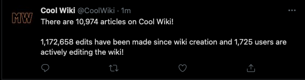
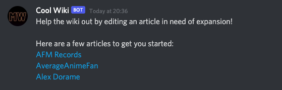

## MWScripts - Stats
**Stats** by MWScripts is a Node.js script that sends wiki statistics (as long as some other information) on a schedule.
It supports sending messages to **Discord** and **Twitter**, with site stats (# of pages, edits etc.) and links to stubs that need editing if applicable.

### Examples
**Site statistics**:


**Stubs**:


### Installation
```shell
$ git clone https://github.com/mw-scripts/stats
$ cd stats
$ pnpm install # or npm install, yarn install

## Edit and rename config.sample.json to config.json!
$ node .
```
